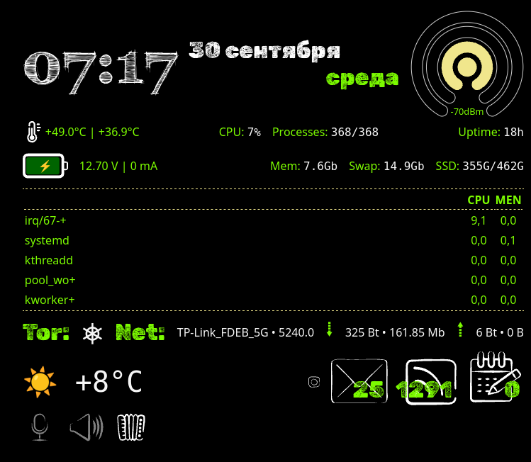

# Runic

Runic is a lightweight engine for rendering HTML/CSS/JS widgets on Linux desktops. A modern alternative to Conky with a web stack: write widgets using familiar HTML, CSS, and JavaScript, while Runic handles system integration through a transparent IPC bridge.

Built with Rust + GTK3 + WebKitGTK + Layer Shell (Wayland).



## Features

- **True web rendering** — HTML5, CSS3, modern JavaScript via WebKitGTK
- **Layer Shell integration** — widgets sit below all windows (or on other layers)
- **Transparent background** — widgets blend seamlessly into the desktop
- **Powerful IPC bridge** — 4 built-in actions: file read/write, command execution, streaming output
- **Flexible positioning** — custom size, coordinates, fullscreen mode
- **Quiet mode** — no log spam by default, debug output enabled with `--debug` flag
- **Async streaming** — long-running command output flows to widgets in real-time
- **Hot-reload** — automatic widget reload when `.html`, `.css`, or `.js` files change (in `--debug` mode)

## Requirements

- **OS**: Linux with Wayland compositor (Sway, Hyprland, Wayfire, etc.)
- **System libraries**: GTK 3.24+, WebKitGTK 4.0, gtk-layer-shell
- **Rust**: 1.70+ (for building)

## Installation

### 1. System dependencies

**Debian 13 / Ubuntu:**

```bash
sudo apt install -y \
    build-essential pkg-config \
    libgtk-3-dev libwebkit2gtk-4.0-dev \
    libgtk-layer-shell-dev
```

**Arch Linux:**

```bash
sudo pacman -S gtk3 webkit2gtk gtk-layer-shell
```

**Fedora:**

```bash
sudo dnf install gtk3-devel webkit2gtk4.0-devel gtk-layer-shell-devel
```

### 2. Build

```bash
git clone <repository-url>
cd runic
cargo build --release
```

The binary will be at `target/release/runic`.

## Usage

### Basic launch

```bash
# Fullscreen widget (default)
./target/release/runic examples/test.html/index.html

# Fixed size 400×300 in top-left corner
./target/release/runic examples/test.html/index.html -w 400 -H 300

# With offset from edges
./target/release/runic examples/test.html/index.html -w 400 -H 300 -x 50 -y 100

# Debug mode (verbose terminal output)
./target/release/runic examples/test.html/index.html --debug
```

### Command-line arguments

| Argument           | Description                  | Default    |
| ------------------ | ---------------------------- | ---------- |
| `html_path`        | Path to the widget HTML file | (required) |
| `-w, --width <N>`  | Window width in pixels       | fullscreen |
| `-H, --height <N>` | Window height in pixels      | fullscreen |
| `-x, --x <N>`      | Offset from left edge        | 0          |
| `-y, --y <N>`      | Offset from top edge         | 0          |
| `-d, --debug`      | Enable verbose output        | false      |

> **Note:** `-x` and `-y` coordinates only work when window size is specified (`-w` and `-H`).

### Autostart in Sway

Add to `~/.config/sway/config`:

```
exec /home/user/runic/target/release/runic /home/user/runic/widgets/clock.html -w 300 -H 150 -x 50 -y 50
```

## Widget API

Runic provides a JavaScript object `window.ipc` for system interaction.

### Sending a message

```javascript
window.ipc.postMessage(
  JSON.stringify({
    action: "exec",
    payload: { command: "uname -a" },
  }),
);
```

### Receiving responses

Define a global handler:

```javascript
window.onRunicResponse = function (response) {
  // response.action  — action name
  // response.status  — "success" | "error" | "stream_data"
  // response.message — text message
  // response.data    — payload (string or null)
  console.log(response);
};
```

### Available actions

#### `read` — read a file

```json
{ "action": "read", "payload": { "path": "/etc/os-release" } }
```

Response: `data` contains file contents.

#### `write` — append to a file

```json
{ "action": "write", "payload": { "path": "/tmp/log.txt", "data": "line\n" } }
```

Parent directories are created automatically. File is opened in `append` mode.

#### `exec` — execute a command

```json
{ "action": "exec", "payload": { "command": "df -h" } }
```

Response: `data` contains `stdout` on success or `STDERR:\n...` on error. Command runs via `sh -c`.

#### `stream` — streaming execution

```json
{ "action": "stream", "payload": { "target": "ping -c 10 8.8.8.8" } }
```

Response arrives multiple times, one line at a time, with status `stream_data`. Perfect for `top`, `ping`, `tail -f`, and other long-running commands. Re-running the same command is blocked until the previous one completes.

## Debug mode

The `--debug` flag enables:

- All IPC messages printed to terminal
- `console.log` from JS redirected to stdout
- Size and positioning information
- **Hot-reload**: automatic widget reload when `.html`, `.css`, `.js` files change in the widget directory (300ms debounce protection)

```bash
cargo run -- examples/test.html/index.html --debug
```

### Widget errors

Command and operation errors are displayed inside the widget (in red text), without cluttering system logs. This allows widgets to gracefully handle failures via CSS/JS.

## License

MIT

## Acknowledgments

Inspired by [Conky](https://github.com/brndnmtthws/conky) and built with excellent Rust bindings:

- [gtk-rs](https://github.com/gtk-rs/gtk3-rs)
- [webkit2gtk-rs](https://github.com/nicokosi/webkit2gtk-rs)
- [gtk-layer-shell-rs](https://github.com/Smithay/gtk-layer-shell-rs)
